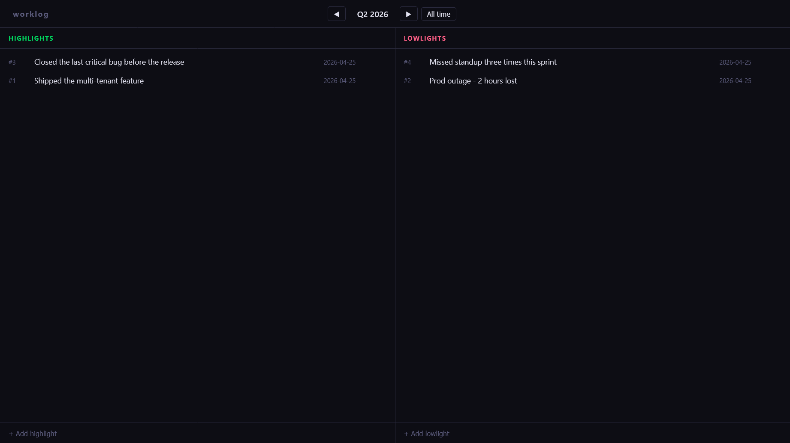

# worklog

[](https://github.com/jquiaios/worklog/releases)
[](https://pkg.go.dev/github.com/jquiaios/worklog)
[](https://goreportcard.com/report/github.com/jquiaios/worklog)
[](./LICENSE)

Log work highlights and lowlights as they happen — so performance reviews aren't a memory test.


<!-- TODO: replace docs/demo.gif with a VHS-generated GIF of the TUI: open → add a highlight → add a lowlight → navigate a quarter → quit -->

> The example above shows the TUI. See [`docs/demo.tape`](./docs/demo.tape) for the source.

## Tutorial

To get started, [install worklog](#installation).

Capture a highlight the moment it happens:

```
worklog hl "Delivered the auth refactor two days ahead of schedule"
```

Capture a lowlight just as quickly:

```
worklog ll "Missed the deploy window on Tuesday"
```

When review season comes around, open the TUI to browse your quarter:

```
worklog
```

Or export everything to Markdown for your review doc:

```
worklog export -y 2025 -o review-2025.md
```

That's it. Keep logging as you go, and you'll never walk into a 1:1 empty-handed again.

## Installation

> **Note**
> worklog stores its data in a SQLite database at `~/.worklog/worklog.db`. Nothing is ever sent over the network.

Use a package manager:

```
# macOS or Linux
brew install jquiaios/tap/worklog
```

Or install with `go` (requires Go 1.25+):

```
go install github.com/jquiaios/worklog/cmd/worklog@latest
```

Or download a pre-built binary from the [Releases page](https://github.com/jquiaios/worklog/releases) for Linux, macOS (Intel + Apple Silicon), or Windows.

<details>
<summary>macOS, Linux, Windows direct download instructions</summary>

```
# macOS (Apple Silicon)
curl -L https://github.com/jquiaios/worklog/releases/latest/download/worklog_Darwin_arm64.tar.gz | tar xz
sudo mv worklog /usr/local/bin/

# macOS (Intel)
curl -L https://github.com/jquiaios/worklog/releases/latest/download/worklog_Darwin_amd64.tar.gz | tar xz
sudo mv worklog /usr/local/bin/

# Linux (amd64)
curl -L https://github.com/jquiaios/worklog/releases/latest/download/worklog_Linux_amd64.tar.gz | tar xz
sudo mv worklog /usr/local/bin/
```

On macOS, if you downloaded the binary directly (not via Homebrew), Gatekeeper will block it on first run. Remove the quarantine flag once:

```
xattr -d com.apple.quarantine /usr/local/bin/worklog
```

</details>

## CLI

The CLI is designed to be fast enough that logging an entry never breaks your flow.

### Add an entry

All of the following are equivalent:

```
worklog highlight "Won the sprint demo with the client"
worklog hl "Won the sprint demo with the client"
worklog add highlight "Won the sprint demo with the client"
worklog add hl "Won the sprint demo with the client"
```

The same shorthands apply to lowlights (`lowlight`, `ll`, `add lowlight`, `add ll`).

### List entries

```
worklog list                    # all entries, newest first
worklog list -t hl              # highlights only
worklog list --type lowlight    # lowlights only
```

Output:

```
#4    2026-04-18  [highlight]  Won the sprint demo with the client
#3    2026-04-17  [lowlight]   Broke prod on Friday afternoon
```

### Delete an entry

```
worklog delete 3
worklog rm 3      # shorthand
```

### Export to Markdown

```
worklog export                        # current quarter, printed to stdout
worklog export -o review.md           # write to file instead

worklog export -q Q1                  # specific quarter (current year)
worklog export -q Q4 -y 2025          # specific quarter of a past year
worklog export -y 2025                # full year (entries grouped by quarter)
worklog export -y 2025 -o 2025.md     # full year, written to file
```

Exports are plain Markdown with `Highlights` and `Lowlights` sections. Full-year exports add `### Q1 2025` subheadings inside each section.

## TUI

Run `worklog` with no arguments to launch the TUI — a two-column view scoped to the current quarter by default.


<!-- TODO: replace docs/tui.png with a static screenshot of the TUI with a few entries populated -->

**Navigation**

| Key   | Action                                |
| ----- | ------------------------------------- |
| `tab` | Switch between Highlights and Lowlights |
| `[`   | Previous quarter                      |
| `]`   | Next quarter                          |
| `a`   | Show all entries (no period filter)   |

**Actions**

| Key | Action                                          |
| --- | ----------------------------------------------- |
| `n` | New entry in the focused column                 |
| `e` | Edit selected entry                             |
| `d` | Delete selected entry (asks for confirmation)   |
| `x` | Export current period to Markdown file          |
| `/` | Filter entries in the focused column            |
| `q` | Quit                                            |

## Web UI

Prefer a browser? `worklog serve` starts a local web UI that mirrors the TUI's two-column layout and auto-refreshes every 3 seconds — so entries added from the CLI or TUI appear without reloading.

```
worklog serve             # opens http://localhost:7171 in your browser
worklog serve -p 8080     # use a different port if 7171 is taken
worklog serve --no-open   # start without opening the browser
```



<!-- TODO: replace docs/web.png with a screenshot of the web UI -->

## Data

Entries live in a SQLite database at `~/.worklog/worklog.db`. It's local, private, and yours — you can back it up, copy it to another machine, or open it with any SQLite client.

## Releasing

Releases are automated via [GoReleaser](https://goreleaser.com/) and GitHub Actions. To cut a new release:

```
git tag v1.2.3
git push origin v1.2.3
```

The workflow builds binaries for all platforms and publishes a GitHub Release automatically.

## Built with

- [Bubble Tea](https://github.com/charmbracelet/bubbletea) — TUI framework
- [Lip Gloss](https://github.com/charmbracelet/lipgloss) — TUI styling
- [Bubbles](https://github.com/charmbracelet/bubbles) — TUI components
- [Cobra](https://github.com/spf13/cobra) — CLI framework
- [modernc/sqlite](https://gitlab.com/cznic/sqlite) — Pure-Go SQLite driver

## Contributing

Issues and pull requests are welcome. See [CONTRIBUTING.md](./CONTRIBUTING.md) for development setup and guidelines.

## License

[MIT](./LICENSE)